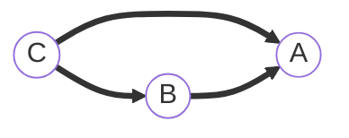
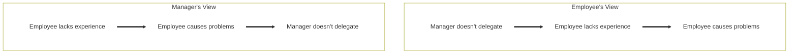
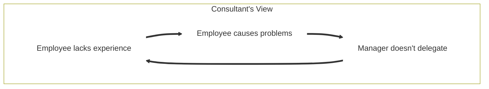
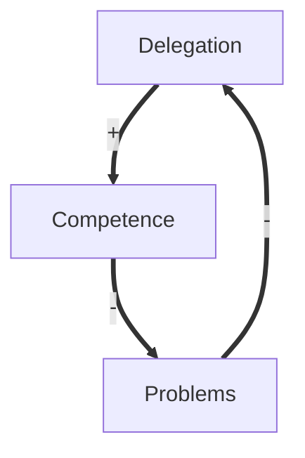

> The major problems in the world are the result of the difference between how nature works and the way people think.

~ Gregory Bateson[^a]

* [ ] Change Mermaid blocks to div class="mermaid"
* [ ] Video also illustrates perspective--is this valuable?

Major problems in the world--[nuclear war](https://80000hours.org/problem-profiles/nuclear-security/), [climate change](https://80000hours.org/problem-profiles/climate-change/), [pandemics](https://80000hours.org/problem-profiles/global-catastrophic-biological-risks/), [artificial intelligence](https://80000hours.org/problem-profiles/positively-shaping-artificial-intelligence/), biotechnology, etc.--means that we have a nonzero [probability of self-annihilation](). How can we learn to think in ways that better understand foreign relations between nuclear powers, climatic systems, ecosystems, intelligent decision-making systems, etc.? Herb Koplowitz notes:

> Barry Commoner (quoted in M. Bateson, 1972) and G. Bateson (1972) refer to the inability of adults, scientists, and laymen alike to understand cyclical, patterned phenomena such as interpersonal relationships and a variety of biological processes because they attempt to understand cause-and-effect patterns as linear.[^b]

Koplowitz sees three groups of stages in adult cognitive development:[^c]

* pre-logical,
* logical, and
* post-logical.

Into these groups I'll place stages of [development]() (using [Bill Joiner](https://changewise.biz/?page_id=249&..)'s names), and discuss example problems and solutions in my [workday experience](https://rowdenw.github.io/about/) with management.

## Pre-Logical Thinking

Pre-logical and pre-conventional thinking is from birth to preteen: Explorer, Enthusiast, and Operator. During the Explorer stage a child develops "object permanence" in what Piaget called the sensorimotor stage, which you can see in a [video on Piaget's Stages of Development](https://www.youtube.com/watch?v=TRF27F2bn-A). During the Ethusiast stage learn identity ("I," "me," "mine") and representational thinking (language).[^d]

The Operator stage, or (United States) grade school years, is the earliest developmental stage that persists into adulthood in noticeable numbers: Susanne R. Cook-Greuter's 1999 study of 4510 United States adults scored 4.3% at either the Ethusiast or Operator stage.[^e] This is [Piaget's "concrete operational stage](https://youtu.be/TRF27F2bn-A?t=254)." The Operator externalizes blame,[^f] and when there are signs of trouble they find the cause in someone or something else. Pre-logical thinkers think of events as a consequence of the events that immediately precede them,[^c] the *post hoc ergo propter hoc* fallacy.

## Logical Thinking

### Conformer

For most girls, the Conformer stage starts at 11 or 12 years old, while for most boys it starts at 12 or 13 years old. The Conformer stage is well-established by 14 or 15 years old.[^d] This is the early stage in what [Piaget called "formal operations](https://youtu.be/TRF27F2bn-A?t=349)," which includes the ability to use hypotheses for deductive reasoning. Cook-Greuter's 1999 study scored 11.3% of adults at this stage, but a study of United States supervisors found 8.2%, and a study of United Kingdom consultants found 1.7%.[^g]

The Conformer stage responds to signs of trouble by identifying conflict, negative emotion, nonconformity, the outsider, or a rule or standard violation.[^h] Consequently one way to mature thinking is to notice situations in which it is not clear who is "wrong."[^i] One tool for this is a retrospective on failures and successes, using Norm Kirth's Prime Directive:[^j]

> Regardless of what we discover, we must understand and truly believe that everyone did the best job he or she could, given what was known at the time, his or her skills and abilities, the resources available, and the situation at hand.

Another approach to support more mature thinking is [working backwards](https://www.allthingsdistributed.com/2006/11/working_backwards.html), for example an [innovation game plan](https://youtu.be/aRff0Fe-3Tk). This can expand thinking beyond a single step to a chain of cause and effect.

### Expert

The Expert stage begins in late adolescence for people who go on to become managers, further developing abstract operations. While perhaps 10% of managers remain in a pre-Expert stage, approximately 45% profile at Expert.[^d] Tools to support decision-making at this stage include [current reality tree](https://www.optimalservicemanagement.com/blog/theory-of-constraints-using-a-current-reality-tree/), [decision journals](https://barryoreilly.com/explore/blog/good-to-great-decisions/), and [futures wheel](https://en.wikipedia.org/wiki/Futures_wheel). While these continue to use linear chains of cause and effect, they broaden thinking to consider multiple causes and multiple effects.

### Achiever

Around 35% of managers profile at Achiever, using full formal operational thinking.[^d] The challenge with linear thinking is identifying the origin of a cause-and-effect chain. The "[micromanagement trap](https://www.informit.com/articles/article.aspx?p=1675546&seqNum=6)" illustrates the difference of perspective that can occur: Managers see their lack of delegation as due to the problems caused by their employees' lack of competence, while employees see their lack of competence as a result of lack of experience with real problems.

A consultant might observe that both perspectives can be true in a loop rather than a chain of cause-and-effect.

A tool to support thinking at this stage is a [causal loop diagram](https://en.wikipedia.org/wiki/Causal_loop_diagram). These diagrams can show the positive or negative influence of each factor: delegation increases competence, which reduces problems. The fewer problems occur, the more comfortable delegation is, and conversely the more problems occur, the more uncomfortable delegation is.

Once cause and effect are seen as cyclical, a manager can shift from solving the problem by finding what or who is to blame, to solving the problem by finding the place with the most "[leverage](http://donellameadows.org/archives/leverage-points-places-to-intervene-in-a-system/)" to change the cycle of cause and effect.[^k]

## Post-Logical, Post-Conventional Thinking

### Catalyst

### Co-Creator

### Synergist

## EndNotes

[^a]: Bateson, N. (2011) _An Ecology of Mind: A Daughter’s Portrait of Gregory Bateson_.
[^b]: Koplowitz, H. (1984) A Projection Beyond Piaget’s Formal-Operations Stage: A General System Stage And A Unitary Stage. In Armon, C.; Commons, M.L.; Richards, F. _Beyond Formal Operations: Late Adolescent and Adult Cognitive Development_; Praeger: New York; [ISBN 978-0-275-91139-3](https://isbn.nu/9780275911393).
[^c]: Koplowitz, H. (1987) Post-Logical Thinking. In _Thinking: The Second International Conference_; Perkins, D.N., Lochhead, J., Bishop, J.C., Eds.; 1st edition.; Routledge; [ISBN 0-89859-805-2](https://isbn.nu/0898598052).
[^d]: Joiner, W.B.; Josephs, S.A. (2006) Leadership Agility: Five Levels of Mastery for Anticipating and Initiating Change; 1st edition.; Jossey-Bass: San Francisco; [ISBN 978-0-7879-7913-3](https://isbn.nu/9780787979133).
[^e]: "Enthusiast" and "Operator" are called "Implusive" and "Opportunist", respectively, in Cook-Greuter, S.R. (2013) [Nine Levels Of Increasing Embrace In Ego Development: A Full-Spectrum Theory Of Vertical Growth And Meaning Making](http://www.cook-greuter.com/Cook-Greuter%209%20levels%20paper%20new%201.1'14%2097p%5B1%5D.pdf). *Prepublication version*, 97.
[^f]: "Operator" is called "Opportunist" in Torbert, W.R. (n.d.) [The Seven Levels of Leadership Development and Their Impact](https://www.gla.global/the-glp/levels-of-leadership-development/).
[^g]: Numbers are for "Conformist" in Cook-Greuter, S.R. (2013) [Nine Levels Of Increasing Embrace In Ego Development: A Full-Spectrum Theory Of Vertical Growth And Meaning Making](http://www.cook-greuter.com/Cook-Greuter%209%20levels%20paper%20new%201.1'14%2097p%5B1%5D.pdf). *Prepublication version*, 97.
[^h]: See "Diplomat" description in Torbert, W.R. (n.d.) [The Seven Levels of Leadership Development and Their Impact](https://www.gla.global/the-glp/levels-of-leadership-development/).
[^i]: William R. Torbert and Elaine Herdman Barker (n.d.). The Global Leadership Profile: Action-Logic Descriptions for Coaches.
[^j]: Kerth, N.L. (2001) _Project Retrospectives: A Handbook for Team Reviews_; Dorset House: New York; [ISBN 978-0-932633-44-6](https://isbn.nu/9780932633446).
[^k]: Meadows, D. (1999) Leverage Points: Places to Intervene in a System. *The Academy for Systems Change*.
